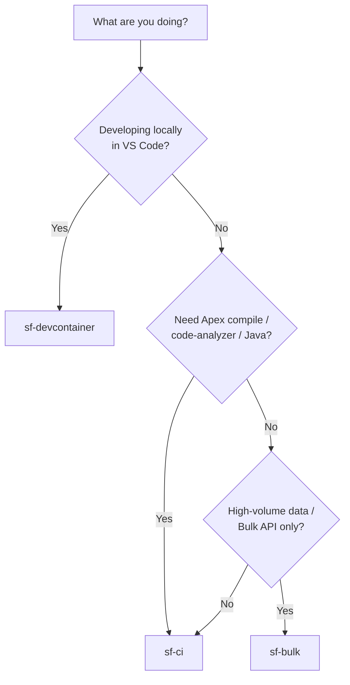

# Salesforce Docker Images

> Lean, tested, multi-arch Docker images for Salesforce CI/CD and development.

[](https://github.com/Gforce-Innovation-Kft/sf-docker-images/actions/workflows/build-and-push.yml)
[](https://github.com/Gforce-Innovation-Kft/sf-docker-images/releases)
[](LICENSE)
[](https://hub.docker.com/r/gforceinnovation/sf-devcontainer)
[](https://hub.docker.com/r/gforceinnovation/sf-devcontainer)
[](https://claude.com/claude-code)

Three purpose-built images for Salesforce work — a minimal CI runner, a full VS Code
devcontainer, and an ultra-light Alpine image for bulk data operations. All are multi-arch
(`linux/amd64` + `linux/arm64`), version-pinned, gated by a test suite, and scanned on every
build.

## What's inside

| Image | Base | Purpose | Size (uncompressed) | Use it when… |
|-------|------|---------|---------------------|--------------|
| [`sf-ci`](sf-ci/README.md) | `ubuntu:22.04` | Minimal CI/CD runner (Node 24 + Java 17 + SF CLI) | ~840 MB | you run deploys, Apex tests, or delta packaging in a pipeline |
| [`sf-devcontainer`](sf-devcontainer/README.md) | `ubuntu:22.04` | Full VS Code dev environment (zsh, editors, extra plugins) | ~2.6 GB | you develop Salesforce locally in VS Code / Dev Containers |
| [`sf-bulk`](sf-bulk/README.md) | `node:24-alpine` | Ultra-light bulk ops, **no Java** | ~410 MB (< 500 MB) | you do high-volume `sf data` / Bulk API work and don't need Apex |

> Live pull/size badges are shown for `sf-devcontainer` (published). `sf-ci` and `sf-bulk`
> sizes above are measured from the current build; their Docker Hub badges will be added once
> those repositories are published. See [the image decision guide](docs/README.md).



## Quick start

### `sf-ci` — in a GitHub Actions job

```yaml
jobs:
  deploy:
    runs-on: ubuntu-latest
    container: gforceinnovation/sf-ci:1
    steps:
      - uses: actions/checkout@v4
      - name: Authenticate to Salesforce
        run: |
          echo "${{ secrets.SF_AUTH_URL }}" > authfile
          sf org login sfdx-url --sfdx-url-file authfile
      - name: Deploy
        run: sf project deploy start
```

### `sf-devcontainer` — in VS Code

Add `.devcontainer/devcontainer.json` (already present at the repo root as an example), then
run **Dev Containers: Reopen in Container** from the Command Palette:

```json
{
  "name": "Salesforce Development",
  "image": "gforceinnovation/sf-devcontainer:latest",
  "customizations": {
    "vscode": { "extensions": ["salesforce.salesforcedx-vscode"] }
  }
}
```

### `sf-bulk` — one-liner

```bash
docker run --rm -v "$(pwd):/workspace" gforceinnovation/sf-bulk:latest sf org list
```

## Supported tags

Images are published with semver tags on every version release, in the style of the official
Docker Library images:

| Tag | Moves? | Points at |
|-----|--------|-----------|
| `1.4.0` | **immutable** | one exact release — pin this in production |
| `1.4` | moving | latest `1.4.x` |
| `1` | moving | latest `1.x.x` |
| `latest` | moving | most recent release |

Pin an immutable tag (`gforceinnovation/sf-ci:1.4.0`) for reproducible pipelines; track a
moving tag (`:1`) to pick up patch and minor updates automatically. The tag matrix is generated
by CI from the pushed git tag (see [`.github/workflows/build-and-push.yml`](.github/workflows/build-and-push.yml)).

## Security & provenance

Every build in CI:

- **Scans** each image with [Trivy](https://github.com/aquasecurity/trivy); results are uploaded
  to GitHub Security (code scanning).
- **Generates an SBOM** and **provenance attestations** on push, so consumers can verify how and
  from what each image was built.
- Runs a **dependency review** on pull requests.

Found a vulnerability? See [`SECURITY.md`](SECURITY.md).

## Design principles

- **Thin by default** — `sf-ci` stays minimal (no editors, no zsh); tests fail the build if
  forbidden tools appear. `sf-bulk` is kept under 500 MB with no Java.
- **Reproducible** — base images and toolchains are pinned; immutable version tags are published
  alongside moving ones.
- **Multi-arch** — `linux/amd64` and `linux/arm64` from a single build.
- **Tested** — every image has a [pytest-testinfra](tests/) suite asserting OS, user, runtimes,
  plugins, tools, env vars, and size budgets. Nothing ships unless the suite is green.
- **Non-root build, container-mode aware** — non-root users are created at build time; SF CLI is
  configured for containers (`SFDX_CONTAINER_MODE`, telemetry/auto-update disabled).

## Development

```bash
./scripts/setup.sh              # verify Docker + Python + gh, install test deps

docker build -t sf-ci:local ./sf-ci
docker build -t sf-devcontainer:local ./sf-devcontainer
docker build -t sf-bulk:local ./sf-bulk

pip install -r tests/requirements.txt
pytest tests/ -v                # all images
pytest tests/test_sf_bulk.py -v # a single image
```

Multi-platform build and push (requires buildx):

```bash
docker buildx create --name multiplatform --use
docker buildx build --platform linux/amd64,linux/arm64 \
  --tag gforceinnovation/sf-ci:latest --push ./sf-ci
```

See [`CONTRIBUTING.md`](CONTRIBUTING.md) for the full workflow and [`CHANGELOG.md`](CHANGELOG.md)
(Keep a Changelog) for release history.

### Releasing

```bash
git tag -a v1.5.0 -m "Release v1.5.0"
git push origin v1.5.0
```

CI then builds all three images multi-arch, runs the tests + Trivy scan, pushes to Docker Hub
with semver tags plus SBOM and provenance, and opens a GitHub Release with notes drawn from the
matching `CHANGELOG.md` section.

## AI-Assisted Development

This repo is developed with [Claude Code](https://claude.com/claude-code) against a disciplined,
committed context — a differentiator, not a shortcut. The loop is
**`CLAUDE.md` → references → skills → tests → release**:

- **[`CLAUDE.md`](CLAUDE.md)** — project overview, commands, and change rules Claude reads first.
- **[`.claude/references/`](.claude/references/)** — rules to read before generating code:
  [docker-best-practices](.claude/references/docker-best-practices.md),
  [image-conventions](.claude/references/image-conventions.md) (per-image size budgets +
  allowed/forbidden tools), [github-actions](.claude/references/github-actions.md),
  [devops](.claude/references/devops.md).
- **[`.claude/skills/`](.claude/skills/)** — repo skills: `building-a-docker-image`,
  `testing-images`, `releasing`, and `working-in-the-devcontainer` (vendored, attributed).
- **Tests** — [pytest-testinfra](tests/) suites gate every change and the CI pipeline.

## Contributing

Issues and PRs are welcome — see [`CONTRIBUTING.md`](CONTRIBUTING.md) and our
[`CODE_OF_CONDUCT.md`](CODE_OF_CONDUCT.md). Commits follow
[Conventional Commits](https://www.conventionalcommits.org/).

## License

[MIT](LICENSE) © [Gforce Innovation Kft](https://gforceinnovation.com) — maintained by
[@gambe94](https://github.com/gambe94).
