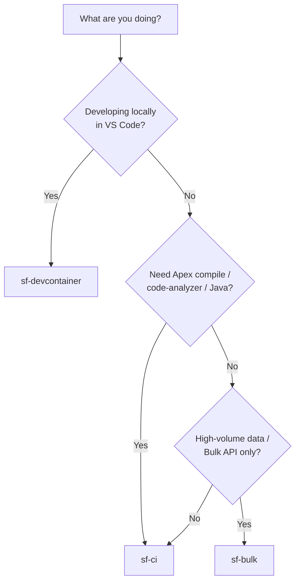

# Salesforce Docker Images

> Lean, tested, multi-arch Docker images for Salesforce CI/CD and development.

[](https://github.com/Gforce-Innovation-Kft/sf-docker-images/actions/workflows/image-sf-ci.yml)
[](https://github.com/Gforce-Innovation-Kft/sf-docker-images/releases)
[](LICENSE)
[](https://hub.docker.com/r/gforceinnovation/sf-ci)
[](https://hub.docker.com/r/gforceinnovation/sf-devcontainer)
[](https://hub.docker.com/r/gforceinnovation/sf-bulk)
[](https://claude.com/claude-code)

Three purpose-built images for Salesforce work — a minimal CI runner, a full VS Code
devcontainer, and an ultra-light Alpine image for bulk data operations. All are multi-arch
(`linux/amd64` + `linux/arm64`), version-pinned, gated by a test suite, and scanned on every
build.

## What's inside

| Image | Base | Purpose | Size (uncompressed) | Use it when… |
|-------|------|---------|---------------------|--------------|
| [`sf-ci`](sf-ci/README.md) | `ubuntu:22.04` | Minimal CI/CD runner (Node 24 + Java 17 + SF CLI) | ~840 MB | you run deploys, Apex tests, or delta packaging in a pipeline |
| [`sf-devcontainer`](sf-devcontainer/README.md) | `ubuntu:24.04` | Full VS Code dev environment (zsh, editors, extra plugins) | ~2.6 GB | you develop Salesforce locally in VS Code / Dev Containers |
| [`sf-bulk`](sf-bulk/README.md) | `node:24-alpine` | Ultra-light bulk ops, **no Java** | ~435 MB (< 600 MB) | you do high-volume `sf data` / Bulk API work and don't need Apex |

All three images ship Node.js 24 and [Salesforce CLI v2](https://developer.salesforce.com/tools/salesforcecli)
(`@salesforce/cli@2.x`, latest at build time) with the `sfdx-git-delta` plugin. See
[the image decision guide](docs/README.md).

### Pull the images

All three are published to Docker Hub under [`gforceinnovation`](https://hub.docker.com/u/gforceinnovation):

```bash
docker pull gforceinnovation/sf-ci:latest            # minimal CI runner
docker pull gforceinnovation/sf-devcontainer:latest  # VS Code devcontainer
docker pull gforceinnovation/sf-bulk:latest          # Alpine bulk-ops image
```

Or extend one in your own Dockerfile:

```dockerfile
FROM gforceinnovation/sf-ci:1.7.0
```


```mermaid
flowchart TD
    A[What are you doing?] --> B{Developing locally<br/>in VS Code?}
    B -- Yes --> C[sf-devcontainer]
    B -- No --> D{Need Apex compile /<br/>code-analyzer / Java?}
    D -- Yes --> E[sf-ci]
    D -- No --> F{High-volume data /<br/>Bulk API only?}
    F -- Yes --> G[sf-bulk]
    F -- No --> E
```

## Quick start

### `sf-ci` — in a GitHub Actions job

```yaml
jobs:
  deploy:
    runs-on: ubuntu-latest
    container: gforceinnovation/sf-ci:latest
    steps:
      - uses: actions/checkout@v4
      - name: Authenticate to Salesforce
        run: |
          echo "${{ secrets.SF_AUTH_URL }}" > authfile
          sf org login sfdx-url --sfdx-url-file authfile
      - name: Deploy
        run: sf project deploy start
```

### `sf-devcontainer` — in VS Code

Add `.devcontainer/devcontainer.json` (already present at the repo root as an example), then
run **Dev Containers: Reopen in Container** from the Command Palette:

```json
{
  "name": "Salesforce Development",
  "image": "gforceinnovation/sf-devcontainer:latest",
  "customizations": {
    "vscode": { "extensions": ["salesforce.salesforcedx-vscode"] }
  }
}
```

### `sf-bulk` — one-liner

```bash
docker run --rm -v "$(pwd):/workspace" gforceinnovation/sf-bulk:latest sf org list
```

### Docker Compose recipes

Copy-paste recipes for sfdx projects — zero-install dev shell, org auth from a
container, CI-parity script testing (Windows-friendly), bulk data ops:
see [`examples/`](examples/README.md).

## Supported tags

Every version release publishes exactly two tags per image:

| Tag | Moves? | Points at |
|-----|--------|-----------|
| `1.7.0` | **immutable** | one exact release — pin this in production |
| `latest` | moving | most recent release |

Pin an immutable tag (`gforceinnovation/sf-ci:1.7.0`) for reproducible pipelines; track
`:latest` to pick up updates automatically. Rolling major/minor tags (`:1`, `:1.6`) are no
longer published — existing ones stay frozen at 1.6.1. The tags are generated by CI from the
pushed git tag (see [`.github/workflows/release.yml`](.github/workflows/release.yml)).

## Security & provenance

Every build in CI:

- **Scans** each image with [Trivy](https://github.com/aquasecurity/trivy); results are uploaded
  to GitHub Security (code scanning).
- **Generates an SBOM** and **provenance attestations** on push, so consumers can verify how and
  from what each image was built.
- **Signs** every pushed image with [cosign](https://docs.sigstore.dev/) (keyless, GitHub OIDC);
  the signature is recorded in the Rekor transparency log. Verify any image with:

  ```bash
  cosign verify \
    --certificate-oidc-issuer https://token.actions.githubusercontent.com \
    --certificate-identity-regexp \
      '^https://github\.com/Gforce-Innovation-Kft/sf-docker-images/\.github/workflows/reusable-docker-image-build\.yml@.+$' \
    gforceinnovation/sf-ci:latest
  ```

  The identity is the CI workflow that built and pushed the image — no keys to manage
  or leak. Swap in `sf-devcontainer` / `sf-bulk` and any published tag.

  > Images published **before 2026-08-06** were signed while the build workflow lived in
  > `shared-github-actions`. Verify those against the old identity instead:
  > `^https://github\.com/Gforce-Innovation-Kft/shared-github-actions/\.github/workflows/docker-build-test-push\.yml@.+$`

Found a vulnerability? See [`SECURITY.md`](SECURITY.md).

## Design principles

- **Thin by default** — `sf-ci` stays minimal (no editors, no zsh); tests fail the build if
  forbidden tools appear. `sf-bulk` is kept under 600 MB with no Java.
- **Reproducible** — base images and toolchains are pinned; immutable version tags are published
  alongside moving ones.
- **Multi-arch** — `linux/amd64` and `linux/arm64` from a single build.
- **Tested** — every image has a [pytest-testinfra](tests/) suite asserting OS, user, runtimes,
  plugins, tools, env vars, and size budgets. Nothing ships unless the suite is green.
- **Non-root at runtime, container-mode aware** — all three images run as a non-root user
  (`ci`/`vscode`, UID 1000), not just build as one; SF CLI is configured for containers
  (`SFDX_CONTAINER_MODE`, telemetry/auto-update disabled). Each image also registers UID **1001**
  (`runner`) so GitHub Actions container jobs can run unprivileged with `options: --user 1001` —
  see the per-image READMEs.

## Development

```bash
./scripts/setup.sh              # verify Docker + Python + gh, install test deps

docker build -t sf-ci:local ./sf-ci
docker build -t sf-devcontainer:local ./sf-devcontainer
docker build -t sf-bulk:local ./sf-bulk

pip install -r tests/requirements.txt
pytest tests/ -v                # all images
pytest tests/test_sf_bulk.py -v # a single image
```

Multi-platform build and push (requires buildx):

```bash
docker buildx create --name multiplatform --use
docker buildx build --platform linux/amd64,linux/arm64 \
  --tag gforceinnovation/sf-ci:latest --push ./sf-ci
```

See [`CONTRIBUTING.md`](CONTRIBUTING.md) for the full workflow and [`CHANGELOG.md`](CHANGELOG.md)
(Keep a Changelog) for release history.

### Releasing

```bash
git tag -a v1.5.0 -m "Release v1.5.0"
git push origin v1.5.0
```

CI then builds all three images multi-arch, runs the tests + Trivy scan, pushes to Docker Hub
(tags `X.Y.Z` + `latest`) with SBOM, provenance, and a keyless cosign signature, and opens a
GitHub Release with notes drawn from the matching `CHANGELOG.md` section plus per-image
tool-version tables (Node, npm, SF CLI, plugins) read from the built images. The per-image
pipeline lives in this repo's own
[`reusable-docker-image-build.yml`](.github/workflows/reusable-docker-image-build.yml);
[`release.yml`](.github/workflows/release.yml) is a thin matrix caller over it.

**Each image has its own workflow** (`image-sf-ci.yml`, `image-sf-devcontainer.yml`,
`image-sf-bulk.yml`), filtered by path, so touching `sf-bulk/Dockerfile` builds and tests
`sf-bulk` alone, a docs-only PR builds nothing, and the images that do build run in parallel.
Changes to a shared input — `tests/requirements.txt` or the reusable workflow — build
everything. Release tags always build the full set so `latest` stays consistent across images.

PRs that touch **sf-ci** additionally run an end-to-end gate: the freshly built image is
published to a throwaway tag and a real downstream Salesforce release pipeline is run against
it, unprivileged, before the PR can go green. That catches breakage the container test suite
cannot see — an image can be internally perfect and still fail as a GitHub Actions container
job.

## AI-Assisted Development

This repo is developed with [Claude Code](https://claude.com/claude-code) against a disciplined,
committed context — a differentiator, not a shortcut. The loop is
**`CLAUDE.md` → references → skills → tests → release**:

- **[`CLAUDE.md`](CLAUDE.md)** — project overview, commands, and change rules Claude reads first.
- **[`.claude/references/`](.claude/references/)** — rules to read before generating code:
  [docker-best-practices](.claude/references/docker-best-practices.md),
  [image-conventions](.claude/references/image-conventions.md) (per-image size budgets +
  allowed/forbidden tools), [devops](.claude/references/devops.md), and
  [local-standards](.claude/references/local-standards.md) — the L3 override holding this
  repo's GitHub Actions and release rules, which the shared `gforce-github-actions` skill
  reads last and honours over the fleet default.
- **[`.claude/skills/`](.claude/skills/)** — repo skills: `building-a-docker-image`,
  `testing-images`, `releasing`, and `working-in-the-devcontainer` (vendored, attributed).
- **Tests** — [pytest-testinfra](tests/) suites gate every change and the CI pipeline.

## Contributing

Issues and PRs are welcome — see [`CONTRIBUTING.md`](CONTRIBUTING.md) and our
[`CODE_OF_CONDUCT.md`](CODE_OF_CONDUCT.md). Commits follow
[Conventional Commits](https://www.conventionalcommits.org/).

## License

[MIT](LICENSE) © [Gforce Innovation Kft](https://gforceinnovation.com) — maintained by
[@gambe94](https://github.com/gambe94).
