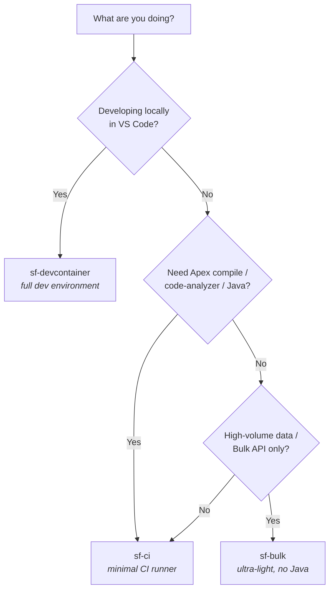

# Which image should I use?

Three images, three jobs. Pick by what you're doing.

| Image | Base | Size | Java | Best for |
|-------|------|------|------|----------|
| [`sf-ci`](../sf-ci/README.md) | `ubuntu:22.04` | ~840 MB | ✅ 17 | deploys, Apex tests, delta packaging in CI |
| [`sf-devcontainer`](../sf-devcontainer/README.md) | `ubuntu:22.04` | ~2.6 GB | ✅ 17 | local development in VS Code |
| [`sf-bulk`](../sf-bulk/README.md) | `node:24-alpine` | ~410 MB | ❌ | high-volume `sf data` / Bulk API work |

Rules of thumb:

- **Pipeline that compiles/scans Apex** → `sf-ci` (has Java 17).
- **Pipeline that only moves data** (bulk upsert, queries, delta calc) → `sf-bulk` (smaller, faster pulls).
- **Interactive local development** → `sf-devcontainer`.

## Media

A short terminal recording of the `sf-devcontainer` zsh shell belongs here:

- **File:** `docs/sf-devcontainer.gif` (referenced from the top-level README once recorded).
- **How to record:** capture with [asciinema](https://asciinema.org/)
  (`asciinema rec`) and convert to GIF with [agg](https://github.com/asciinema/agg), or record the
  terminal directly. Keep it short (~10 s): open the container, show the P10k prompt, run
  `sf version`.

## Social preview

A 1280×640 social preview image (GitHub repo **Settings → Social preview**) improves link
unfurls. It cannot be set via `gh` — upload it in repo settings. Suggested copy:

- **Title:** sf-docker-images
- **Tagline:** Lean, tested, multi-arch Docker images for Salesforce CI/CD & development
- **Footer chips:** `sf-ci` · `sf-devcontainer` · `sf-bulk`
- **Style:** dark background, Salesforce-blue accent, monospace image names.
