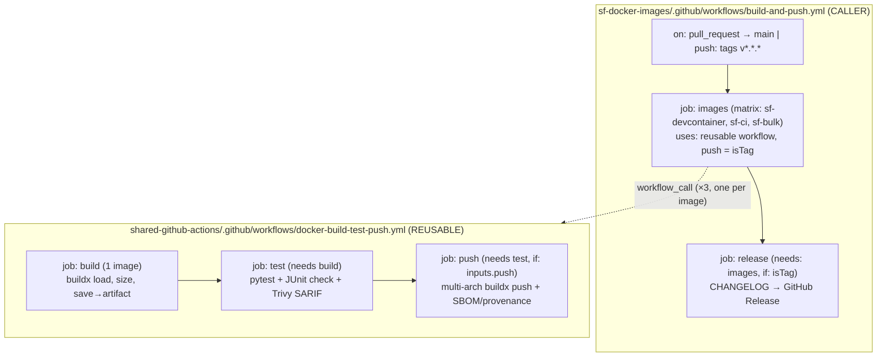

# Design: Convert `build-and-push.yml` into a Reusable Shared Workflow

**Status:** Design (approved shape) — ready for Claude Code implementation
**Author:** GForce Innovation
**Scope:** Two repos — `shared-github-actions` (new reusable workflow) and `sf-docker-images` (thin caller)
**Date:** 2026-07-01

---

## 1. Goal

Extract the per-image build → test → push logic currently duplicated across a
matrix in `sf-docker-images/.github/workflows/build-and-push.yml` into a single
**reusable workflow** (`workflow_call`) hosted in `shared-github-actions`, so any
repo in the org can build/test/push a Docker image with a few lines of YAML.

`sf-docker-images` becomes a thin **caller** that invokes the reusable workflow
once per image via a matrix, and keeps its repo-specific `release` job locally.

Hard requirement: **build, test, and push must behave exactly as they do today**
(same triggers, same tags, same PR checks, same security uploads).

---

## 2. Current state (as-is)

`build-and-push.yml` — one workflow, four jobs, each matrixed over the three
images (`sf-devcontainer`, `sf-ci`, `sf-bulk`):

| Job | Runs when | What it does |
|-----|-----------|--------------|
| `build` | PR to `main` + `v*.*.*` tags | Buildx build (`load: true`, single-arch), report size to step summary, `docker save`→gzip, upload tar artifact (retention 1 day). GHA cache `type=gha`. |
| `test` | after `build` | Download+load tar, setup Python, `pip install -r tests/requirements.txt`, run `pytest tests/test_<image>.py` with JUnit XML, publish results as a PR check (`EnricoMi/publish-unit-test-result-action`), Trivy scan → SARIF → upload to GitHub Security. `fail-fast: false`. |
| `push` | after `test`, **tags only** | Download+load tar, buildx, Docker Hub login, `docker/metadata-action` (semver + `latest`), `docker/build-push-action` multi-platform `linux/amd64,linux/arm64` `push: true` with `sbom: true, provenance: true`. |
| `release` | after `push`, **tags only** | Checkout full history, extract the tag's section from `CHANGELOG.md`, create GitHub Release (`softprops/action-gh-release`). |

Workflow-level: `concurrency` group per ref (cancel on PR); `permissions`
`contents: read`, `packages: write`, `security-events: write`; env
`DOCKERHUB_USERNAME: gforceinnovation`; secret `DOCKERHUB_TOKEN`.

**Observation (behavioral):** `push` re-runs `build-push-action` from `context`
for multi-arch — the downloaded tar is only truly consumed by `test`. The
`packages: write` permission is unused (push targets Docker Hub via
`DOCKERHUB_TOKEN`, not GHCR/`GITHUB_TOKEN`). Both are preserved for parity in
this migration and flagged as optional cleanups in §9.

---

## 3. Target architecture (to-be)



The reusable workflow owns exactly one image's **build → test → push**. The
caller fans out to three images with a matrix and owns the repo-specific
**release**.

---

## 4. Reusable workflow spec

**File:** `shared-github-actions/.github/workflows/docker-build-test-push.yml`
**Reference:** `gforceinnovation/shared-github-actions/.github/workflows/docker-build-test-push.yml@main`

### 4.1 Interface

```yaml
name: Docker Build/Test/Push (Reusable)

on:
  workflow_call:
    inputs:
      image-name:
        description: 'Image name, e.g. sf-ci. Also selects tests/test_<name-with-underscores>.py'
        required: true
        type: string
      context:
        description: 'Docker build context path, e.g. ./sf-ci'
        required: true
        type: string
      push:
        description: 'Push multi-platform image to the registry (set true only on release tags)'
        required: false
        default: false
        type: boolean
      dockerhub-username:
        description: 'Docker Hub org/namespace'
        required: false
        default: 'gforceinnovation'
        type: string
      platforms:
        description: 'Comma-separated build platforms for the push stage'
        required: false
        default: 'linux/amd64,linux/arm64'
        type: string
      python-version:
        description: 'Python version for the test stage'
        required: false
        default: '3.x'
        type: string
      trivy-version:
        description: 'aquasecurity/trivy-action version'
        required: false
        default: 'v0.36.0'
        type: string
      artifact-retention-days:
        description: 'Retention for the intermediate image tar artifact'
        required: false
        default: 1
        type: number
    secrets:
      dockerhub-token:
        description: 'Docker Hub access token (required only when push = true)'
        required: false
```

### 4.2 Jobs (mirror today's build/test/push, scoped to one image)

- **`build`** — `permissions: { contents: read }`. Checkout → Buildx →
  `build-push-action` (`context: inputs.context`, `load: true`,
  `tags: ${{ inputs.image-name }}:test`, `cache-from/to: type=gha`) → size to
  `$GITHUB_STEP_SUMMARY` → `docker save | gzip` → upload artifact
  `${{ inputs.image-name }}-image` (retention `inputs.artifact-retention-days`).
- **`test`** — `needs: build`, `permissions: { contents: read, checks: write,
  pull-requests: write, security-events: write }`. Checkout → download+load
  artifact → setup Python `inputs.python-version` →
  `pip install -r tests/requirements.txt` → derive
  `TEST_FILE=test_${image-name//-/_}.py` → `pytest` with JUnit XML → publish
  results check → Trivy scan `image-name:test` → SARIF → upload to Security.
  Keep `if: always()` on publish/upload steps.
- **`push`** — `needs: test`, `if: ${{ inputs.push }}`,
  `permissions: { contents: read }`. Checkout → download+load artifact → Buildx →
  Docker Hub login (`username: inputs.dockerhub-username`,
  `password: secrets.dockerhub-token`) → `metadata-action`
  (`images: ${{ inputs.dockerhub-username }}/${{ inputs.image-name }}`) →
  `build-push-action` (`platforms: inputs.platforms`, `push: true`,
  `sbom: true`, `provenance: true`, `cache-from/to: type=gha`).

  **Tagging (changed from today):** push exactly **two** tags — the release
  version from the git tag, and `latest`. Drop the rolling `{{major}}.{{minor}}`
  and `{{major}}` tags:

  ```yaml
  - id: meta
    uses: docker/metadata-action@v5
    with:
      images: ${{ inputs.dockerhub-username }}/${{ inputs.image-name }}
      tags: |
        type=semver,pattern={{version}}   # v1.2.3 → 1.2.3
        type=raw,value=latest
  ```

  `{{version}}` strips the leading `v` (git tag `v1.2.3` → image tag `1.2.3`),
  which is the Docker convention. If you'd rather push the literal git tag
  including the `v` (`v1.2.3`), swap the first line for
  `type=raw,value=${{ github.ref_name }}`.

  **Version report (new):** after push, capture the actual tool versions *from
  the built image* (source of truth, not the Dockerfile) and upload them as a
  per-image artifact for the caller's `release` job to aggregate. This runs in
  `push`, so it only executes on release tags — exactly when a release is
  created.

  ```yaml
  - name: Build version report
    run: |
      IMG=${{ inputs.image-name }}:test
      run() { docker run --rm --entrypoint sh "$IMG" -c "$1"; }
      NODE=$(run 'node -v')
      NPM=$(run 'npm -v')
      SF=$(run 'sf version' | head -n1)          # e.g. @salesforce/cli/2.x.x ...
      OUT="version-report-${{ inputs.image-name }}.md"
      {
        echo "### \`${{ inputs.image-name }}\`"
        echo
        echo "| Component | Version |"
        echo "| --- | --- |"
        echo "| Node.js | ${NODE} |"
        echo "| npm | ${NPM} |"
        echo "| Salesforce CLI | ${SF} |"
        echo
        echo "| Plugin | Version |"
        echo "| --- | --- |"
        run 'sf plugins --json' \
          | jq -r '.[] | "| \(.name) | \(.version) |"'   # jq runs on the runner
        echo
      } > "$OUT"

  - uses: actions/upload-artifact@v4
    with:
      name: version-report-${{ inputs.image-name }}
      path: version-report-${{ inputs.image-name }}.md
      retention-days: ${{ inputs.artifact-retention-days }}
  ```

  Notes: run all version commands via `--entrypoint sh -c` so it works across
  the bash-based (`sf-ci`, `sf-bulk`) and zsh-based (`sf-devcontainer`) images
  alike. `sf plugins --json` lists the installed non-core plugins
  (`sfdx-git-delta`, and for `sf-devcontainer` also `code-analyzer` and
  `sfdx-browserforce-plugin`); add `--core` if you also want the bundled core
  plugins. `jq` is preinstalled on `ubuntu-latest`.

The internal `build → test → push` job chain and the artifact handoff are kept
**identical** to today, guaranteeing behavior parity. The only change is that the
matrix moves *out* to the caller (one reusable-workflow invocation per image).

---

## 5. Caller spec (`sf-docker-images`)

**File:** `sf-docker-images/.github/workflows/build-and-push.yml` (rewritten)

```yaml
name: Build and Push Docker Images

on:
  push:
    tags: ['v*.*.*']
  pull_request:
    branches: [main]

concurrency:
  group: ${{ github.workflow }}-${{ github.ref }}
  cancel-in-progress: ${{ github.event_name == 'pull_request' }}

jobs:
  images:
    name: ${{ matrix.image.name }}
    strategy:
      fail-fast: false
      matrix:
        image:
          - { name: sf-devcontainer, context: ./sf-devcontainer }
          - { name: sf-ci,           context: ./sf-ci }
          - { name: sf-bulk,         context: ./sf-bulk }
    permissions:
      contents: read
      checks: write
      pull-requests: write
      security-events: write
    uses: gforceinnovation/shared-github-actions/.github/workflows/docker-build-test-push.yml@main
    with:
      image-name: ${{ matrix.image.name }}
      context: ${{ matrix.image.context }}
      push: ${{ startsWith(github.ref, 'refs/tags/v') }}
    secrets:
      dockerhub-token: ${{ secrets.DOCKERHUB_TOKEN }}

  release:
    name: Create GitHub Release
    runs-on: ubuntu-latest
    needs: images
    if: startsWith(github.ref, 'refs/tags/v')
    permissions:
      contents: write
    steps:
      - uses: actions/checkout@v4
        with: { fetch-depth: 0 }

      # Download every per-image version report the reusable push jobs uploaded
      - name: Download version reports
        uses: actions/download-artifact@v4
        with:
          pattern: version-report-*
          path: version-reports
          merge-multiple: true

      - name: Assemble release notes
        id: notes
        run: |
          VERSION="${GITHUB_REF_NAME#v}"
          NOTES_FILE="$(mktemp)"
          # 1) CHANGELOG section for this tag (unchanged awk extraction)
          awk -v ver="$VERSION" '
            /^## \[/ { if (found) exit; if (index($0,"["ver"]")) { found=1; next } }
            found { print }
          ' CHANGELOG.md > "$NOTES_FILE"
          [ -s "$NOTES_FILE" ] || echo "Release ${GITHUB_REF_NAME}." > "$NOTES_FILE"
          # 2) Append the per-image tool-version tables
          {
            echo
            echo "## Image tool versions"
            echo
            cat version-reports/version-report-*.md
          } >> "$NOTES_FILE"
          echo "notes_file=${NOTES_FILE}" >> "$GITHUB_OUTPUT"

      - name: Create GitHub Release
        uses: softprops/action-gh-release@v2
        with:
          tag_name: ${{ github.ref_name }}
          name: ${{ github.ref_name }}
          body_path: ${{ steps.notes.outputs.notes_file }}
          generate_release_notes: true
```

Notes:
- **Permissions live on the calling job**, not inside the reusable workflow — the
  caller's `GITHUB_TOKEN` scope caps what the reusable jobs can do. The set above
  covers the test job's check/PR/security uploads.
- `push` is computed once from the ref and passed as a boolean input; the
  reusable `push` job gates on it. This replaces the per-job
  `if: startsWith(github.ref, 'refs/tags/v')`.
- `concurrency` stays in the caller (it groups the caller run).
- `release` keeps its CHANGELOG extraction and now also downloads the
  `version-report-*` artifacts and appends a tool-version table per image.

### 5.1 Rendered release notes (example)

The release body becomes the CHANGELOG section followed by:

> ## Image tool versions
>
> ### `sf-ci`
>
> | Component | Version |
> | --- | --- |
> | Node.js | v24.4.1 |
> | npm | 10.8.2 |
> | Salesforce CLI | @salesforce/cli/2.x.x |
>
> | Plugin | Version |
> | --- | --- |
> | sfdx-git-delta | 5.x.x |
>
> ### `sf-devcontainer`
>
> | Component | Version |
> | --- | --- |
> | Node.js | v24.4.1 |
> | npm | 10.8.2 |
> | Salesforce CLI | @salesforce/cli/2.x.x |
>
> | Plugin | Version |
> | --- | --- |
> | code-analyzer | x.y.z |
> | sfdx-git-delta | 5.x.x |
> | sfdx-browserforce-plugin | x.y.z |
>
> _(…and `sf-bulk`)_

---

## 6. Behavior parity matrix

| Concern | Today | After | Parity |
|---------|-------|-------|--------|
| Trigger: PR to main | build + test | build + test (push input=false) | ✅ |
| Trigger: `v*.*.*` tag | build + test + push + release | build + test + push + release | ✅ |
| Images covered | 3 (matrix) | 3 (matrix in caller) | ✅ |
| Single-arch test build + tar handoff | yes | yes (inside reusable) | ✅ |
| pytest + JUnit PR check | yes | yes | ✅ |
| Trivy SARIF → Security tab | yes | yes | ✅ |
| Multi-arch push + SBOM + provenance | tags only | tags only (`inputs.push`) | ✅ |
| Image tags pushed | `1.2.3`, `1.2`, `1`, `latest` | **`1.2.3` + `latest` only** | ⚠️ intentional change |
| GHA cache `type=gha` | yes | yes | ✅ |
| `fail-fast: false` on test | yes | yes (caller matrix) | ✅ |
| Release from CHANGELOG | yes | yes (stays in caller) | ✅ |
| Tool-version tables in release | no | **yes — node/npm/sf/plugins per image** | ➕ new |
| Concurrency cancel on PR | yes | yes (caller) | ✅ |

---

## 7. Branching & rollout order

Two feature branches, referenced across repos during development, flipped to
`@main` at the end. Reusable workflows can be referenced by branch, so the caller
can point at the shared feature branch until it merges.

1. **`shared-github-actions`** — branch `feat/docker-build-test-push-reusable`.
   Add the reusable workflow + README section. Open PR. (No push happens; the
   file is inert until called.)
2. **`sf-docker-images`** — branch `feat/reusable-docker-workflow`. Rewrite the
   caller, **temporarily** referencing the shared feature branch:
   `...docker-build-test-push.yml@feat/docker-build-test-push-reusable`. Open PR
   → PR trigger runs **build + test** for all three images (no push). Verify all
   green.
3. **Merge shared PR** to `main`.
4. **Flip the ref** in the `sf-docker-images` PR from the feature branch to
   `@main` (optionally pin to a tag/SHA — see §9), push that commit, confirm PR
   still green, then merge.
5. **Post-merge push verification** — cut a throwaway pre-release tag (e.g.
   `v0.0.0-rc1`) or the next real tag to confirm the multi-arch push + release
   path end-to-end, since the push stage never runs on PRs.

### Atomic commits

**`shared-github-actions`** (repo convention: `Add:`/`Fix:`/`Update:`/`Docs:`):
- `Add: reusable docker build/test/push workflow (single image)`
- `Docs: document docker-build-test-push reusable workflow in README`

**`sf-docker-images`** (repo convention: conventional commits):
- `refactor: call shared docker-build-test-push reusable workflow` (caller
  rewrite, pointing at shared feature branch)
- `ci: pin reusable workflow to @main` (the ref flip in step 4)
- `docs: note reusable workflow migration` (link this design / update CLAUDE.md
  + CHANGELOG)

Each commit is self-contained and leaves the repo in a working state.

---

## 8. Verification plan

- **Static:** `yamllint` (shared repo pre-commit + `ci.yml`) passes; GitHub
  accepts the `workflow_call` interface (invalid inputs/secrets fail fast at
  dispatch).
- **PR run (both repos green):** all three images build + test; JUnit checks
  appear per image; Trivy SARIF lands in the Security tab; **no** push occurs.
- **Tag run:** multi-arch images pushed to Docker Hub with semver + `latest`
  tags; SBOM + provenance attached; single `release` created from the CHANGELOG
  section.
- **Diff review:** confirm the rendered job graph and check names before/after;
  the per-image check now nests under the reusable workflow (grouped by image) —
  this is the one cosmetic difference from today.

---

## 9. Risks, tradeoffs & optional cleanups

- **Check-name grouping changes.** Reusable-workflow jobs render nested under the
  calling matrix job (grouped per image) rather than as three flat top-level
  jobs. Functionally equivalent; branch-protection required-check names may need
  updating if any are pinned. **Mitigation:** review required checks after the
  first PR run and re-select if needed.
- **Cross-repo coupling.** The caller depends on the shared workflow at `@main`.
  A breaking change in shared can break the caller. **Mitigation:** pin to a tag
  or commit SHA (`...@v1` / `...@<sha>`) instead of `@main` for supply-chain
  safety and reproducibility; bump deliberately.
- **Secret required-ness.** `dockerhub-token` is `required: false` so PR runs
  (which never push) don't fail validation; the `push` job only consumes it when
  `inputs.push` is true. Confirm `DOCKERHUB_TOKEN` exists in `sf-docker-images`
  Actions secrets.
- **Dropping rolling tags is breaking for downstream pins.** Consumers pinning
  `gforceinnovation/<image>:1` or `:1.2` will stop receiving updates once only
  `{{version}}` + `latest` are pushed. **Mitigation:** confirm nothing pins the
  major/minor rolling tags; note the change in `CHANGELOG.md` and the image
  READMEs so consumers move to an exact version or `latest`.
- **Optional cleanup — drop `packages: write`.** Unused today (push goes to
  Docker Hub via `DOCKERHUB_TOKEN`). Not carried into the caller's permission
  set. Confirm nothing else relied on it.
- **Optional cleanup — push stage rebuilds from context.** The `push` job
  re-runs `build-push-action` multi-arch rather than reusing the single-arch tar
  (unavoidable for multi-platform). The tar download in `push` is redundant and
  could be removed later; kept now for a minimal, parity-preserving diff.
- **`dependency-review` mention in CLAUDE.md.** CLAUDE.md lists a
  `dependency-review` job that is not in the current workflow. Treat CLAUDE.md as
  slightly stale; update it as part of the `docs:` commit.

---

## 10. Implementation checklist (for Claude Code)

**shared-github-actions** (branch `feat/docker-build-test-push-reusable`):
- [ ] Add `.github/workflows/docker-build-test-push.yml` per §4 (incl. version-report step + artifact in the push job).
- [ ] Add README "Reusable Workflows" entry (inputs/secrets/permissions).
- [ ] Run pre-commit / `yamllint`; open PR.

**sf-docker-images** (branch `feat/reusable-docker-workflow`):
- [ ] Rewrite `.github/workflows/build-and-push.yml` per §5, ref = shared feature branch.
- [ ] Update `release` job to download `version-report-*` artifacts and append the per-image tables (§5).
- [ ] Open PR; confirm build+test green for all three images.
- [ ] After shared merges: flip ref to `@main` (or pinned tag/SHA); re-confirm green; merge.
- [ ] Update `CLAUDE.md` (CI/CD section) + `CHANGELOG.md`.
- [ ] Tag a release to verify push + release path.
```
